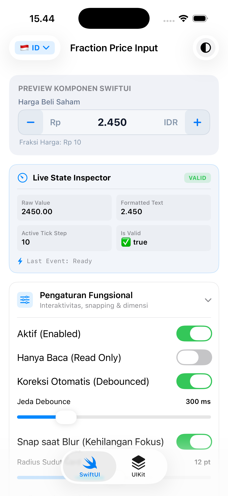
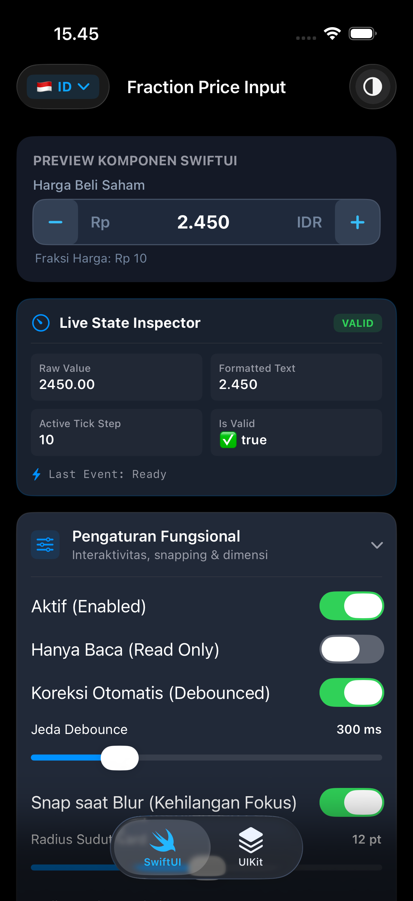
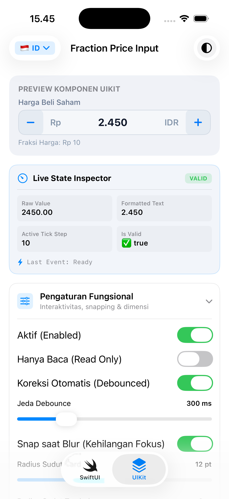
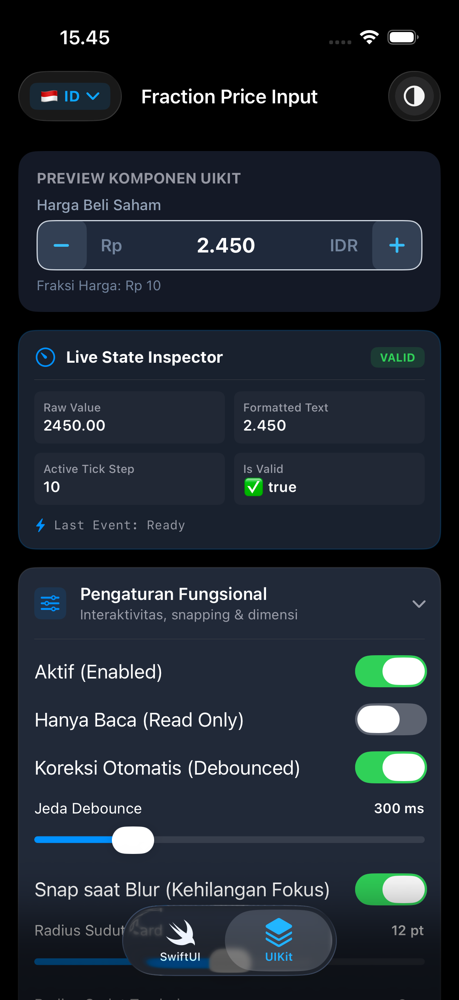

# R2Art Fraction Price Input for iOS 🇮🇩 📈

[](https://swift.org)
[](https://apple.com)
[](https://developer.apple.com)
[](https://cocoapods.org)
[](#-license)

An industry-grade stock fraction tick price input component for **iOS Native (Swift)** supporting both **SwiftUI** and **UIKit**, fully compliant with **Indonesia Stock Exchange (Bursa Efek Indonesia / BEI / IDX)** regulations.

Ported from the Flutter package [`r2art_fraction_price_input`](https://pub.dev/packages/r2art_fraction_price_input) and Android library [`r2art-fraction-price-input-android`](https://github.com/NaturalizerINA/r2art-fraction-price-input-android).

---

## 📸 Screenshots

| SwiftUI (Light Mode) | SwiftUI (Dark Mode) | UIKit (Light Mode) | UIKit (Dark Mode) |
| :---: | :---: | :---: | :---: |
|  |  |  |  |

---

## 🌟 Key Highlights

* **🇮🇩 Official IDX / BEI 5-Tier Rule Compliance**: Out-of-the-box support for the latest Bursa Efek Indonesia fraction tick rules and boundary crossing calculations (e.g. `199 <-> 200`, `498 <-> 500`, `1.995 <-> 2.000`, `4.990 <-> 5.000`).
* **⚡ 100% Dual UI Toolkit Parity**: First-class support for **SwiftUI** (`FractionPriceField`) and **UIKit** (`FractionPriceView`) with identical styling, animations, and behaviors.
* **📐 Seamless Flush Segmented Layout**: Zero-gap outer card design with flush plus/minus stepper buttons and ergonomic margin spacing on currency prefix and suffix.
* **🔤 Pixel-Perfect Unified Typography**: Exact font size and weight parity between SwiftUI and UIKit (13pt Medium header, 12pt Regular dynamic footer, 15pt Semibold prefix/suffix, 18pt Bold numeric price, and 16pt Bold stepper icons).
* **🎨 10 Granular Color Tokens**: Complete visual customization (`containerColor`, `textColor`, `labelColor`, `helperColor`, `errorColor`, `buttonContainerColor`, `buttonIconColor`, `unfocusedBorderColor`, `focusedBorderColor`, `errorBorderColor`), with adaptive dark/light mode support.
* **🚀 Press-and-Hold Stepper Acceleration**: Smooth continuous hold speed curve accelerating from `160ms` down to `40ms` per tick with native haptic feedback (`UIImpactFeedbackGenerator`).
* **🪄 Debounced Auto-Correction & Snap-on-Blur**: Automatically corrects invalid typed values to the nearest valid fraction without cursor jumps or intrusive popups.
* **🌐 Bilingual Runtime Localization (i18n)**: Instant switching between Indonesian (`.id`) and English (`.en`) with automatic thousands separator formatting (`.` in ID vs `,` in EN) and 4 customizable error closures.
* **🧪 100% Tested Pure Swift Engine**: `FractionPriceCore` is a standalone, cross-platform Swift library covered with comprehensive XCTest unit tests.

---

## 📋 BEI / IDX 5-Tier Fraction Rules

| Price Range | Tick Size (*Fraksi*) | Max Step |
| :--- | :--- | :--- |
| **< Rp 200** (Rp 1 – Rp 199) | **Rp 1** | Rp 10 (10 ticks) |
| **Rp 200 – Rp 500** (Rp 200 – Rp 498) | **Rp 2** | Rp 20 (10 ticks) |
| **Rp 500 – Rp 2.000** (Rp 500 – Rp 1.995) | **Rp 5** | Rp 50 (10 ticks) |
| **Rp 2.000 – Rp 5.000** (Rp 2.000 – Rp 4.990) | **Rp 10** | Rp 100 (10 ticks) |
| **≥ Rp 5.000** (≥ Rp 5.000) | **Rp 25** | Rp 250 (10 ticks) |

---

## 📦 Installation

### Swift Package Manager (SPM)

In Xcode, select **File > Add Package Dependencies...** and enter the repository URL:
```
https://github.com/NaturalizerINA/r2art-fraction-price-input-ios.git
```

Or add it directly to your `Package.swift`:
```swift
dependencies: [
    .package(url: "https://github.com/NaturalizerINA/r2art-fraction-price-input-ios.git", from: "1.0.0")
]
```

### CocoaPods

Add the pod to your `Podfile`:
```ruby
pod 'R2ArtFractionPriceInput', '~> 1.0.0'
```
Then run:
```bash
pod install
```

---

## 🚀 Usage Guide

### 1. Modern SwiftUI (`FractionPriceField`)

```swift
import SwiftUI
import FractionPriceCore
import FractionPriceSwiftUI

struct StockOrderView: View {
    @State private var price: Double? = 2450.0

    var body: some View {
        VStack(spacing: 20) {
            FractionPriceField(
                value: $price,
                rule: TieredTickRule.idx(),
                localization: .id,
                labelText: "Harga Beli Saham",
                prefixText: "Rp",
                suffixText: "IDR",
                autoCorrection: true,
                autoCorrectionDelayMs: 300,
                snapOnBlur: true,
                cornerRadius: 12,
                buttonCornerRadius: 8,
                onSubmitted: { submittedPrice in
                    print("Order submitted at: \(String(describing: submittedPrice))")
                }
            )
        }
        .padding()
    }
}
```

### 2. Classic UIKit (`FractionPriceView`)

```swift
import UIKit
import FractionPriceCore
import FractionPriceUIKit

class StockOrderViewController: UIViewController {

    private let fractionPriceView = FractionPriceView()

    override func viewDidLoad() {
        super.viewDidLoad()
        setupUI()
    }

    private func setupUI() {
        view.addSubview(fractionPriceView)
        fractionPriceView.translatesAutoresizingMaskIntoConstraints = false

        NSLayoutConstraint.activate([
            fractionPriceView.topAnchor.constraint(equalTo: view.safeAreaLayoutGuide.topAnchor, constant: 24),
            fractionPriceView.leadingAnchor.constraint(equalTo: view.leadingAnchor, constant: 16),
            fractionPriceView.trailingAnchor.constraint(equalTo: view.trailingAnchor, constant: -16)
        ])

        // Configure properties
        fractionPriceView.rule = TieredTickRule.idx()
        fractionPriceView.localization = .id
        fractionPriceView.labelText = "Harga Beli Saham"
        fractionPriceView.prefixText = "Rp"
        fractionPriceView.suffixText = "IDR"
        fractionPriceView.autoCorrection = true
        fractionPriceView.snapOnBlur = true
        fractionPriceView.setPrice(2450.0)

        // Event callbacks
        fractionPriceView.onPriceChanged = { newPrice in
            print("Current price: \(String(describing: newPrice))")
        }
        fractionPriceView.onSubmitted = { finalPrice in
            print("Price submitted: \(String(describing: finalPrice))")
        }
    }
}
```

---

## 🎨 Color Customization (10 Tokens)

Both SwiftUI and UIKit components support full design system theming via 10 granular color tokens:

### SwiftUI (`FractionPriceColors`)
```swift
let customColors = FractionPriceColors(
    containerColor: Color(hex: "#1E293B"),
    textColor: Color(hex: "#F8FAFC"),
    labelColor: Color(hex: "#94A3B8"),
    helperColor: Color(hex: "#64748B"),
    errorColor: Color(hex: "#EF4444"),
    buttonContainerColor: Color(hex: "#334155"),
    buttonIconColor: Color(hex: "#38BDF8"),
    unfocusedBorderColor: Color(hex: "#475569"),
    focusedBorderColor: Color(hex: "#38BDF8"),
    errorBorderColor: Color(hex: "#EF4444")
)

FractionPriceField(
    value: $price,
    colors: customColors
)
```

### UIKit (`FractionPriceViewColors`)
```swift
fractionPriceView.colors = FractionPriceViewColors(
    containerColor: UIColor(hex: "#1E293B"),
    textColor: UIColor(hex: "#F8FAFC"),
    labelColor: UIColor(hex: "#94A3B8"),
    helperColor: UIColor(hex: "#64748B"),
    errorColor: UIColor(hex: "#EF4444"),
    buttonContainerColor: UIColor(hex: "#334155"),
    buttonIconColor: UIColor(hex: "#38BDF8"),
    unfocusedBorderColor: UIColor(hex: "#475569"),
    focusedBorderColor: UIColor(hex: "#38BDF8"),
    errorBorderColor: UIColor(hex: "#EF4444")
)
```

---

## 🌐 Dynamic Localization & Custom Error Closures

Easily override standard validation error messages with dynamic closure templates:

```swift
let customLocalization = FractionPriceLocalization.id.copyWith(
    emptyPriceError: { "Wajib diisi: Masukkan harga beli!" },
    belowMinError: { min in "Harga minimal pasar adalah \(min)!" },
    aboveMaxError: { max in "Harga melebihi ARA pasar (\(max))!" },
    invalidTickError: { step, nearest in "Fraksi \(step) tidak valid. Rekomendasi: \(nearest)" }
)

// Pass to field
FractionPriceField(
    value: $price,
    localization: customLocalization
)
```

---

## 📱 Interactive Showcase App

A complete iOS Showcase application is available in the `Example/` directory:

1. Open `Example/FractionPriceSample.xcodeproj` in Xcode.
2. Select any simulator (e.g. **iPhone 17**, **iPhone 16 Pro**).
3. Press **Cmd + R** to run.

**Showcase Features:**
* 🔄 **Dual-Tab Parity**: Side-by-side comparison between SwiftUI and UIKit implementations.
* 🇮🇩 / 🇬🇧 **Instant Language Switcher**: Real-time conversion of thousands separators (`2.450` in ID vs `2,450` in EN).
* 🌓 **Adaptive Theme Mode**: System, Light, and Dark mode preview.
* 🎨 **10 Live Color Pickers**: Interactive color token customizer with real-time UI updates.
* 📊 **Live State Inspector Card**: Real-time monitoring of raw double values, formatted text, active tick step, validation status badge, and event stream.

---

## 🧪 Unit Testing

Run the comprehensive unit test suite via Swift CLI or Xcode:

```bash
swift test
```

```
Test Suite 'FractionPriceControllerTests' passed (4 tests)
Test Suite 'FractionPriceLocalizationTests' passed (3 tests)
Test Suite 'TieredTickRuleTests' passed (9 tests)
Executed 16 tests, with 0 failures (0 unexpected)
```

---

## 📄 License

```text
MIT License

Copyright (c) 2026 Rahmad Setiawan Mukminullah

Permission is hereby granted, free of charge, to any person obtaining a copy
of this software and associated documentation files (the "Software"), to deal
in the Software without restriction, including without limitation the rights
to use, copy, modify, merge, publish, distribute, sublicense, and/or sell
copies of the Software, and to permit persons to whom the Software is
furnished to do so, subject to the following conditions:

The above copyright notice and this permission notice shall be included in all
copies or substantial portions of the Software.

THE SOFTWARE IS PROVIDED "AS IS", WITHOUT WARRANTY OF ANY KIND, EXPRESS OR
IMPLIED, INCLUDING BUT NOT LIMITED TO THE WARRANTIES OF MERCHANTABILITY,
FITNESS FOR A PARTICULAR PURPOSE AND NONINFRINGEMENT. IN NO EVENT SHALL THE
AUTHORS OR COPYRIGHT HOLDERS BE LIABLE FOR ANY CLAIM, DAMAGES OR OTHER
LIABILITY, WHETHER IN AN ACTION OF CONTRACT, TORT OR OTHERWISE, ARISING FROM,
OUT OF OR IN CONNECTION WITH THE SOFTWARE OR THE USE OR OTHER DEALINGS IN THE
SOFTWARE.
```
